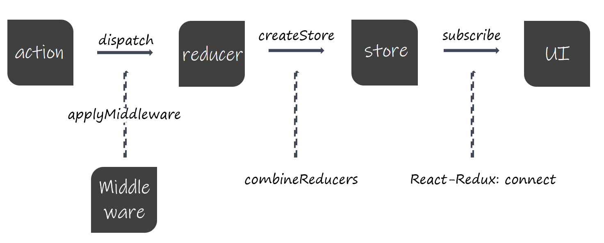

## 前言

JavaScript 不严谨、缺陷很多，前端代码只是为了业务⽽⽣。代码⼏乎没⼈去管理或者根本就管不了，代码可维护性⼤⼤降低，review 代码的过程太痛苦了。但是⽆论是⽤户层⾯还是企业层⾯，对前端越来越重视，前端⻚⾯的展示信息越来越多，交互也越来越复杂，前端⼯程复杂度越来越⾼。这时候，JavaScript 的维护组织 ECMA 出⼿了，ES6 出现了。这可以算是前端发展史上的⼀个很重要的转折点，解决了 JavaScript 的很多受⼈诟病的设计，结合社区的贡献提出了新的思想，⽐如 Promise、Class等。

## 模块化

为什么要先说说模块化？我认为模块化的出现才给了前端更强⼤的⽣命⼒，给 React、Vue 等框架的诞⽣提供了技术可能性。没有模块化就没有组件的概念，更别说封装。
模块化给前端⼯程代码的可复⽤性和可维护性提供了更多的可能性。前端社区活跃起来，⼤家都乐于⽤⼀个好⽤的语⾔去表达⾃⼰的想法。
前端资源能变得越来越⼩。模块化可以很容易的分辨出重复的部分，前端资源打包可以按需加载，去除冗余部分。

## 避免 DOM 操作

前端开发者都知道操作 DOM 是前端经常要做的事，同时代价也是⾮常昂贵的。那时候我们知道，前端就是⽤ JS 操作 DOM，嫌弃原⽣ JS 不好⽤，于是使⽤ jQuery 去更⽅便去操作 DOM。 AngularJS 提供了数据和视图绑定的思想。由状态去反应视图的变化，这⼀概念是先进的。但是⼈们发现，还是在频繁的操作 DOM，应⽤越来越复杂，性能越来越低。 Facebook 的⼯程师提出了 Virtual DOM 的概念，把 DOM 变成⼀个普通的 JS 对象放到内存中。当 state 发⽣变化要反应到 view 之前，⽤ diff 算法先进⾏⽐对，只操作发⽣变化的 DOM，最⼤程度上的去避免 DOM 操作，⽽⼜充分利⽤了 JS 引擎的性能。
从 state 反应到 view，再利⽤ diff 算法⽐较新旧两个 Virtual DOM，最⼤程度去避免没必要的 DOM 操作，再最终给⽤户呈现新的⻚⾯。这就是 React 的思想。
⽆论是 React 还是 Vue，仅仅只是 UI 视图层的框架，并没有对数据层有任何的限制。随着应⽤越来越庞⼤和复杂，这样过度放权视图层对数据层的管理是不好的。所以，如何管理 state 成了新的难题。

## Flux 思想

Flux 不是⼀个库的名字，⽽是⼀种架构思想。对于状态管理，Flux 的思维是单向的，先将之前放权到视图层中修改数据层的 controller 进⾏收集，统⼀管理，组件需要触发数据层的变化就需要去触发 Dispatcher，然后 Dispatcher 将 action 引⽤到 model 上，实现数据层的修改，最终反应到视图层展示。

这个思想的核⼼就在单向数据流和 Dispatcher。⽤户可以注册 Action，对不同的 Action 注册不同的回 调。在 View 层可以触发 Action（可选择带上 payload）从⽽改变 Store。

## Redux

Facebook ⼯程师们的⼜⼀杰作。基于 Flux 的思想，Redux 也需要去统⼀维护⼀个数据层，也是单向数据流。不同点在于，Redux 不允许直接对数据层进⾏修改，只允许通过 Action 对象来描述需要做的变更。
Redux 中引⼊了⼀个新的概念：Reducer。在 Redux 中，去掉了 Flux 思想的 Dispatcher，转⽽⽤⼀个纯函数 Reducer 代替，接收原来的 state 和 action 作为参数，并⽣成⼀个新的 state 代替原来的 state。

刚刚说这个 Reducer 是个纯函数，也是在拥抱函数式编程。输⼊⼀样，输出⼀定⼀样，这就是纯函数。如果输⼊⼀样，输出不⼀样了，这其中⼀定存在副作⽤。
这样的话，前端状态不仅可以很好的统⼀管理起来，还变得可维护可预测了。整个数据流⾛向特别清晰，可追溯，记录每次状态的变更以及视图快照，实现时间旅⾏。

## Vuex

Vuex 是 Vue 的状态管理⼯具，也是 Flux 思想的产物。与 Redux 基本类似，但是没有 Reducer 的概念。Vuex 中的 state 是可以被修改的，它也需要被修改。这是跟 Vue 的运⾏机制有关系的，Vue 基于 ES5 中的 getter/setter 来实现视图和数据的双向绑定，因此 Vuex 中 state 的变更可以通过 setter 通知到视图中对应的指令来实现视图更新。这也是响应式编程的体现。

Vuex 中的 state 是可修改的，⽽修改 state 的⽅式不是通过 Actions，⽽是通过 Mutations。⼀个 Mutation 是由⼀个 type 和与其对应的 handler 构成的，type 是⼀个字符串类型⽤以作为 key 去识别具体的某个 Mutation，handler 则是对 state 实际进⾏变更的函数。
其实现在看来，Actions 是可有可⽆的，View 层可以直接跨越 Actions 去找 Mutations 完成数据的修改。那 Actions 是⽤来⼲嘛的呢？Vuex 的思想是：Mutations 必须是同步函数，⽽ Actions 可以包含任意异步操作。
最终，View 层触发 Actions，Actions 决定是否需要做异步操作，并根据实际情况传递数据给 Mutations，Mutations 接收到相应的 Actions 去修改 state，从⽽通过 getter/setter 的双向绑定反应到 View 层。

## MobX
Mobx 和 Redux 相⽐，差别就⽐较⼤了。如果说 Redux 吸收并发扬了很多函数式编程思想的话，MobX 则更多体现了⾯向对象的特点。

MobX 有这么⼏个特点：
1. Observable。它的 state 是可被观察的，⽆论是基本数据类型还是引⽤数据类型，都可以使⽤ MobX 的 @observable 来转变为 observable value
2. Reactions。它包含不同的概念，基于被观察数据的更新导致某个计算值（computed values），或者是发送⽹络请求以及更新视图等，都属于响应的范畴，这也是响应式编程在 JavaScript 中的⼀个应⽤
3. Actions。它相当于所有响应的源头，例如⽤户在视图上的操作，或是某个⽹络请求的响应导致的被观察数据的变更

与 Redux 对单向数据流的严格规范不同，MobX 只专注于从 store 到 view 的过程，没有 Redux 的 Reducer 以及 Vuex 的 Mutations 的概念。在 Redux 中，数据的变更需要监听，⽽ MobX 的数据依赖是基于运⾏时的，这点和 Vuex 更为接近。
MobX 可以准确的修改与变化数据有关的组件，⽆关组件不会做任何的更新操作。操作 state 最⽅便，开发成本最低，对开发者特别友好。事物总是有利有弊，当 state 变得庞⼤了之后，state 被随意修改的弊端就会出现了。很难维护、⼏乎不可追溯，这对开发者来说也是噩梦的存在。所以，对于⼤型应⽤⽽⾔，⼀般不会使⽤ MobX。MobX 是对⼀个⼩型应⽤开发者极其友好的状态管理库。